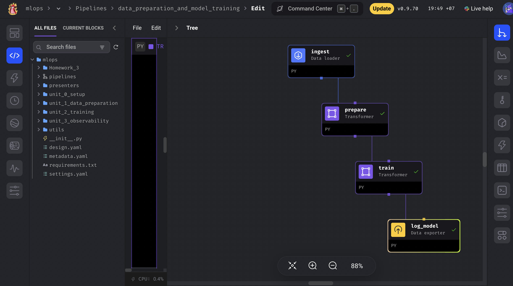

## MLOps Orchestration

This week is about orchestration of machine learning projects with [Mage AI](https://www.mage.ai/) with integration of [MLFLow](https://mlflow.org/)<br><br>
Mage is an open-source, hybrid framework for transforming and integrating data.<br>

#### Link to practice repo - [MLOps Orchestration with Mage](https://github.com/Hokfu/MLOps_Orchestration_with_Mage)

## Mage AI 

#### Mage AI setup

To start mage ai, 

```
docker pull mageai/mageai:latest

```

```
docker run -it -p 6789:6789 -v $(pwd):/home/src mageai/mageai /app/run_app.sh mage start [project_name]

```

<br>
For my project, I used this repo with docker compose template. <br>

```
git clone https://github.com/mage-ai/mlops.git
cd mlops
./scripts/start.sh
```

Here is my project. [MLOps Orchestration with MageAI](https://github.com/Hokfu/MLOps_Orchestration_with_Mage)
<br>
To start my project, clone this repo and 
```
cd mlops
./scripts/start.sh
```
<br>

Here is my homework [link](https://github.com/Hokfu/MLOps_Orchestration_with_Mage/tree/main/mlops/Homework_3)
<br>
In my homework, I built pipeline with four blocks 
- Ingest (data loader)
- Data Preparation (transformer)
- Train Model (transformer)
- Log the model with MLFlow (data exporter)
<br><br>

<br><br>
The trained model is registerd and kept in artifact and the feature matrix is also recorded in artifact with MLFlow. 
